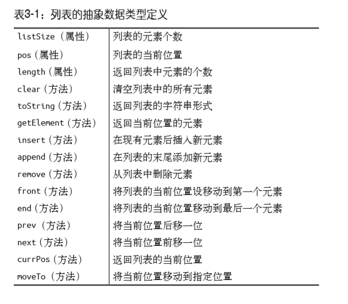

# 列表
  
## 实现列表类
### append:给列表添加元素
```
function append(element){
    this.dataStore[this.listSize++] = element;
}
```
### remove:从列表中删除元素
- find()查找元素
```
function find(element){
    for(var i = 0;i < this.dataStore.length;++i){
        if(this.dataStore[i]==element){
            return i;
        }
    }
    return -1
}
```

```
function remove(element){
    var foundAt = this.find(element);
    if(foundAt > -1){
        this.dataStore.splice(foundAt,1);
        --this.listSize;
        return true;
    }
    return false;
}
```
### length：列表中有多少个元素
```
function length(){
    return this.listSize;
}
```
### toString:显示列表中的元素
```
function toString(){
    return this.dataStore;
}
```
严格说来，该方法返回的是一个数组，而不是一个字符串，但它的目的是为了显示列表的 当前状态，因此返回一个数组就足够了。
### insert：向列表中插入一个元素
```
function insert(element,after){
    var insertPos = this.find(after);
    if(insertPos > -1){
        this.dataStore.splice(insertPos+1,0,element);
        ++this.listSize;
        return true;
    }
    return false;
}
```
### clear：清空列表中所有的元素
```
function clear(){
    delete this.dataStore;
    this.dataStore = [];
    this.listSize = this.pos = 0;
}
```

### contains：判断给定值是否在列表中
```
function contains(element){
    for(var i = 0;i < this.dataStore.length;++i){
        if(this.dataStore[i]==element){
            return true;
        }
    }
    return false;
}
```