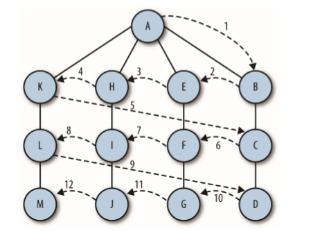

# 广度优先搜索
广度优先遍历是从某个顶点出发，首先访问这个顶点，然后找出刚访问这个结点所有未被访问的邻结点，访问完后再访问这些结点中第一个邻结点的所有结点，重复此方法，直到所有结点都被访问完为止。  

 

```
//递归写法
function wideTraversal(node){
    let nodes = [],i=0;
    if(node!=null){
        nodes.push(node);
        wideTraversal(node.nextElementSibling);
        node=nodes[i++];
        wideTraversal(node.firstElementChild);
    }
    return nodes;
}

//非递归
function wideTraversal(node){
    let nodes=[],i=0;
    while(node!=null){
        nodes.push(node);
        node=nodes[i++];
        let childrens=node.children;
        for(let i=0;i<childrens.length;i++){
            nodes.push(childrens[i]);
        }
    }
    return nodes;
}


function wideTraversal(node){
    var nodes = [];
    if(node!=null){
        var queue = [];
        queue.unshift(node);
        while(queue.length !=0){
            var item = queue.shift();
            nodes.push(item);
            var children = item.children;
            for(var i=0;i<children.length;i++){
                queue.push(chldren[i]);
            }
        }
        return nodes;
    }
}
```