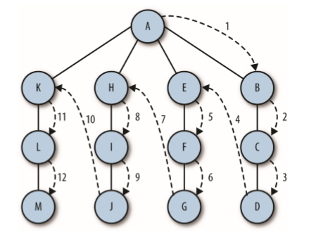

# 深度优先搜索
深度优先搜索包括从一条路径的起始顶点开始追溯，直到到达最后一个顶点，然后回溯， 继续追溯下一条路径，直到到达最后的顶点，如此往复，直到没有路径为止  
  

递归实现：**访问一个没有访问过的顶点，将它标记为已访问，再递归地 去访问在初始顶点的邻接表中其他没有访问过的顶点**

```
//递归写法
function deepTraversal(node){
    let nodes = [];
    if(node!=null){
        nodes.push[node];
        let childrens = node.children;
        for(let i=0;i<childrens.length;++i){
            deepTraversal(childrens[i]);
        }
        return nodes;
    }
}

function deepTraversal(node,nodeList){
    if(node){
        nodeList.push(node);
        var children = node.children;
        for(var i=0;i<children.length;i++){
            //每次递归的时候将需要遍历的节点和节点所存储的数组传下去
            deepTraversal(children[i],nodeList);
        }
        return nodeList;
    }
}

//非递归写法
function deepTraversal(node){
    let nodes = [];
    if(node!=null){
        //用来存放将来要访问的节点
        let stack = [];
        stack.push(node);
        while(stack.length!=0){
            //正在访问的节点
            nodes.push(item);
            let childrens = item.children;
            for(let i=childrens.length-1;i>=0;i--){
               //将现在访问的节点的子节点存入stack,供将来访问
                stack.push(chldrens[i]);
            }
        }
    }
}

function deepTraversal(node){
    var nodeList = [];
    if(node){
        var stack = [];
        stack.push(node);
        while(stack.length!=0){
            var childrenItem = stack.pop();
            nodeList.push(childrenItem);
            var childrenLIst = childrenItem.children;
            for(var i=chldrenList.length-1;i>=0;i--){
                stack.push(childrenList[i]);
            }
        }
        return nodeList;
    }
}
```