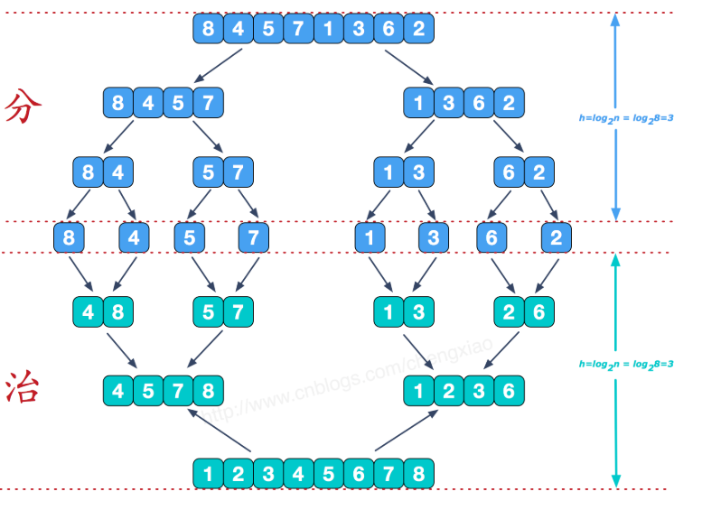
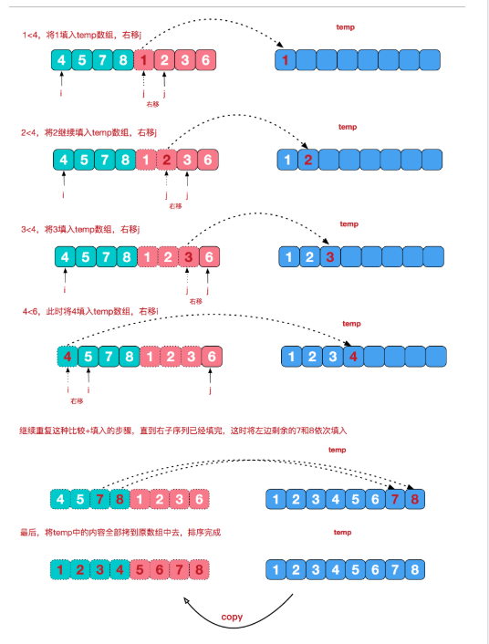

# 归并排序  
**算法复杂度**为O(n log n次方)
该算法采用经典的分治（divide-and-conquer）策略（分治法将问题分(divide)成一些小的问题然后递归求解，而治(conquer)的阶段则将分的阶段得到的各答案"修补"在一起，即分而治之)。  
  
  

```
class ArrayList{
    constructor(){
        this.array = [];
    }
    insert(item){
        this.array.push(item);
    }
    toString(){
        return this.array.join()
    }

    //并归函数入口
    mergeSort(){
        this.array = this.mergeSortRec(this.array);
    }

    //将数组递归拆分成只有一个元素的数组
    mergeSortRec(array){
        const length = array.length;
        if(length === 1){
            return array;
        }

        const mid = Math.floor(length/2);//取中间值
        const left = array.slice(0,mid), //左切片
        right = array.slice(mid,length);  //右切片
        return this.merge(this.mergeSortRec(left),this.mergeSortRec(right)) //递归调用
    }

    merge(left,right){
         // 如果理解不了的话可以看控制台打印出来的内容然后带入下面的迭代就比较好懂了。
        console.log(left,right);
        const result = [];//声明一个数组用来储存归并过程中的新数组
        let il=0,ir=0;//两个用于迭代的变量
        while(il<left.length && ir<right.length){//迭代两个数组
           if(left[il] < right[ir]){//对比左边是否小于右边
              result.push(left[il++]);// 如果是那么将左边添加到数组
           }else{
               result.push(right[ir++]); // 如果不是则将右边添加到数组
           }
        }
        while(il < left.length){// 接下来将左边数组剩余项添加到归并数组中
            result.push(left[il++]);
        }
        while(ir<right.length){// 将右边数组生育项添加到归并数组中
            result.push(right[ir++]);
        }
        return result;
    }
}

// 测试排序代码
// 逆序创建一个ArrayList
const arr = new ArrayList()
arr.insert(4)
arr.insert(2)
arr.insert(8)
arr.insert(3)
arr.insert(5)
arr.insert(1)
arr.insert(7)
arr.insert(6)
console.log(arr.toString()) // 确定为逆序
arr.mergeSort()
console.log(arr.toString()) // 确定排序完毕
```