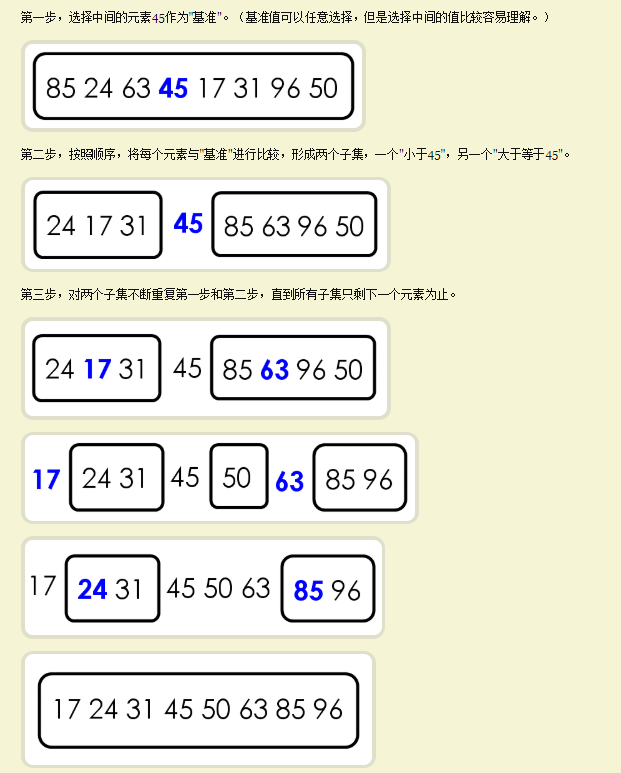

# 快速排序
**思想原理：**  
1. 在数据集中，选择一个元素作为“基准”(pivot)
2. 所有小于“基准”的元素，都移到“基准”的左边；所有大于“基准”的元素，都移到“基准”的右边
3. 对“基准”左边和右边的两个子集，不断重复第一步和第二部，直到所有子集只剩下一个元素为止。  

  

```
class ArrayList{
    constructor(){
        this.array = [];
    }
    insert (item){
        this.array.push(item);
    }
    toString(){
        return this.array.join();
    }

    //快速排序入口

    quickSort(){
        //调用递归函数传入数组，和数组开始及结束位置下标
        this.quick(this.array,0,this.array.length-1);
    }

    quick(array,left,right){
        let index;//声明一个变量用于储存分离较小数组和较大数组（在它左边的就是小他右边的就是大）
        if(array.length > 1){
            //数组小于1就不进行排序
            index = this.partition(array,left,right);
            if(left<index-1){
                this.quick(array,left,index-1);
            }
            if(index<right){
                this.quick(array,index,right);
            }
        }
    }

    partition(array,left,right){
        console.log(array,left,right);
        const pivot = array[Math.floor((right+left)/2)];
        console.log('中间值下标',pivot);
        let i=left,j=right;
        while(i<=j){
            console.log('while迭代',array,i,j);
            while(array[i]<pivot){
                i++;
            }
            while(array[j]>pivot){
                j--;
            }
            if(i<=j){
                this.swapQuickSort(array,i,j);
                i++;
                j--;
            }
        }
        console.log('返回i',i);
        return i;
    }
    swapQuickSort(array,index1,index2){
        const aux = this.array[index1];
        this.array[index1]=this.array[index2];
        this.array[index2]=aux;
    }
}

// 测试排序代码
// 逆序创建一个ArrayList
const arr = new ArrayList()
arr.insert(4)
arr.insert(2)
arr.insert(8)
arr.insert(3)
arr.insert(5)
arr.insert(1)
arr.insert(7)
arr.insert(6)
console.log(arr.toString()) // 确定为逆序
arr.quickSort()
console.log(arr.toString()) // 确定排序完毕
```