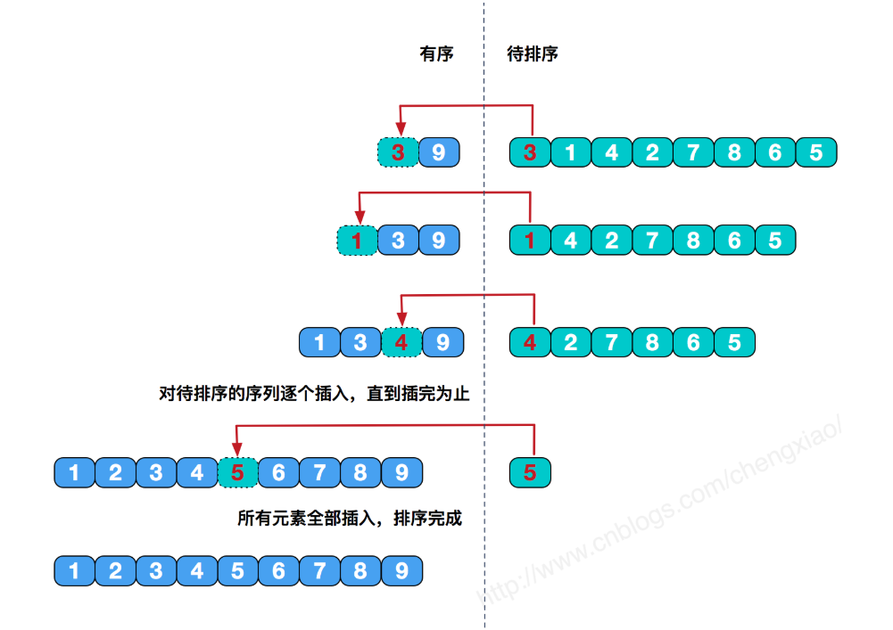

# 插入排序
**工作原理：**  
每一步将一个待排序的记录，插入到前面已经排好序的有序序列中去，直到插完所有元素为止。  
  
```
class ArrayList {
    constructor () {
        this.array = []
    }
    insert (item) {
        this.array.push(item)
    }
    toString () {
        return this.array.join()
    }
    swap(index1, index2) {
    // 交换数组的两个元素
        const aux = this.array[index1]
      this.array[index1] = this.array[index2]
      this.array[index2] = aux
    }

   insertionSort(){
       const length = this.array.length;
       let j,temp;

       for(let i=1;i<length;i++){
           j=i;
           temp=this.array[i];
           while(j>0&&this.array[j-1]>temp){
               this.array[j]=this.array[j-1];
               j--;
           }
           this.array[j] = temp;
       }
   }
}

// 测试排序代码
// 逆序创建一个ArrayList
function createNonSortedArray(size) {
    const arr = new ArrayList()
  for (let i = size; i > 0; i --) {
    arr.insert(i)
  }
  return arr
}
const arr = createNonSortedArray(100)
console.log(arr.toString()) // 确定为逆序
arr.insertionSort()
console.log(arr.toString()) // 确定排序完毕
```