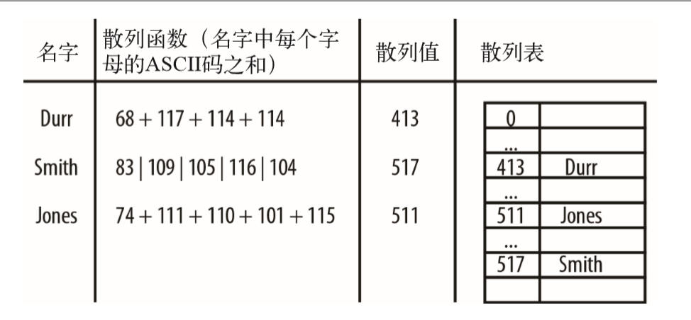

# 散列
散列使用的数据 结构叫做散列表  
  

## HashTable类
```
function HashTable(){
    this.table = new Array(137);
    this.simpleHash = simpleHash;
    this.showDistro = showDistro;
    this.put = put;
    //this.get = get;
}

//将字符串中每个字符的 ASCII 码值相加
//ASCII 码值的和除以数组长度的余数
function simpleHash(data){
    var total = 0;
    for(var i=0;i<data.length;++i){
        total +=data.charCodeAt(i);
    }
    return total % this.table.length;
}

//将数据存入散列表
function put(data){
    var pos = this.simpleHash(data);
    this.table[pos] = data;
}

//显示散列表中的数据
function showDistro(){
    var n = 0;
    for(var i = 0;i<this.table.length;++i){
        if(this.table[i]!=undefined){
            print(i+":"+this.table[i]);
        }
    }
}
```

### 避免碰撞
即使使用一个高效的散列函数，仍然存在将两个键映射成同一个值的可能，这种现象称为 碰撞（collision)  
为了避免碰撞，首先要确保散列表中用来存储数据的数组其大小是个质数。  
，新 的散列函数仍然先计算字符串中各字符的 ASCII 码值，不过求和时每次要乘以一个质数。  
```
function betterHash(string,arr){
    const H = 37;
    var total = 0;
    for(var i=0;i<string.length;++i){
        total += H*total + string.charCodeAt(i);
    }
    total = total%arr.length;
    return parseInt(total);
}
```

## 碰撞处理
- 开链法
- 线性探测法

### 开链法
开链法是指实现散列表的底层数组中，每个数组 元素又是一个新的数据结构，比如另一个数组，这样就能存储多个键了。使用这种技术， 即使两个键散列后的值相同，依然被保存在同样的位置，只不过它们在第二个数组中的位 置不一样罢了。  
**实现开链法的方法是**：在创建存储散列过的键值的数组时，通过调用一个函数创建一个新 的空数组，然后将该数组赋给散列表里的每个数组元素。

```
function buildChains(){
    for(var i = 0;i<this.table.length;++i){
        this.table[i]=new Array();
    }
}


//第一个用来保存键值，第二个用来保存数据
function put(key,data){
    var pos = this.betterHash(key);
    var index = 0;
    if(this.table[pos][index]==undefined){
        this.table[pos][index+1] = data;
    }
    ++index;
    else{
        while(this.table[pos][index]!=undefined){
            ++index;
        }
        this.table[pos][index+1] = data;
    }
}

function get(key){
    var index = 0;
    var hash = this.betterHash(key);
    if(this.table[pos][index]=key){
        return this.table[pos][index+1];
    }
    index +=2
    else{
        while(this.table[pos][index]!=key){
            index +=2;
        }
        return this.table[pos][index+1];
    }
    return undefined;
}
```

### 线性探测法
**开放寻址散列**  
。当发生碰撞时，线性探测法检查散列表中的下一个位置是否为空。如果为空， 就将数据存入该位置；如果不为空，则继续检查下一个位置，直到找到一个空的位置为 止。

```
function put(key,data){
    var pos = this.betterHash(key);
    if(this.table[pos]==undefined){
        this.table[pos] = key;
        this.values[pos]=data;
    }
    else{
        while(this.table[pos]!=undefined){
            pos++;
        }
        this.table[pos]=key;
        this.values[pos]=data;
    }
}

function get(key){
    var hash = -1;
    hash = this.betterHash(key);
    if(hash>-1){
        for(var i=hash;this.table[hash]!=undefined;i++){
            if(this.table[hash]==key){
                return this.values[hash];
            }
        }
    }
    return undefined;
}
```