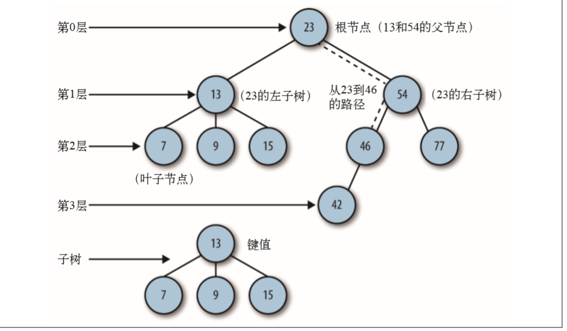
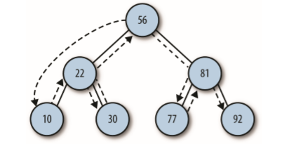
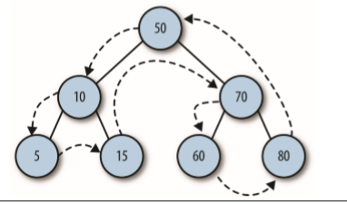
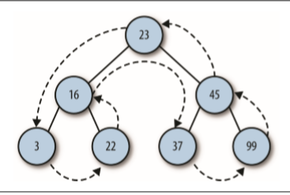

# 树
  
## 二叉树和二叉查找树
二叉树每个节点的子节点不允许超过两个
### 实现二叉查找树
**二叉查找树是一种 特殊的二叉树，相对较小的值保存在左节点中，较大的值保存在右节点中。**  

二叉查找树(BST)查找正确插入点的算法如下：
1. 设根节点为当前节点
2. 如果待插入节点保存的数据小于当前节点，则设新的当前节点为原节点的左节点；反之，执行第4步.
3. 如果当前节点的左节点为null,就将新的节点插入这个位置，推出循环；反之，继续执行下一次循环。
4. 设新的当前节点为原节点的右节点
5.  如果当前节点的右节点为 null，就将新的节点插入这个位置，退出循环；反之，继续 执行下一次循环。

```
function Node(data,left,right){
    this.data = data;
    this.left = left;
    this.right = right;
    this.show = show;
}

function show(){
    return this.data;
}

function BST(){
    this.root = null;
    this.insert = insert;
    this.inOrder = inOrder;
}

function insert(data){
    var n=new Node(data,null,null);
    if(this.root == null){
        this.root = n;
    }
    else{
        //检查 BST 是否有根节点，如果没有，那么这是棵新树，该节点就是根节点
        var current = this.root;
        var parent;
        while(true){
            parent = current;
            if(data<current.data){
                current = current.left;
                //如果当前节点的左节点为 null，就将新的节点插入这个位置
                if(current == null){
                    parent.left = n;
                    break;
                }
            }
            else{
                current = current.right;
                if(current == null){
                    parent.right = n;
                    break;
                }
            }
        }
    }
}
```

### 遍历二叉查找树
- 中序遍历：以升序访问树中所有节点，先访问左子树，再访问根节点，最后访问右子树
- 先序遍历：先访问根节点，然后访问左节点和右节点
- 后序遍历：先访问叶子节点，从左子树到右子树，再到根节点

### 中序遍历
```
function inOrder(node){
    if(!(node==null)){
        inOrder(node.left);
        putstr(node.show()+" ");
        inOrder(node.right);
    }
}
```


### 先序遍历
```
function preOrder(node){
    if(!(node==null)){
        putstr(node.show()+" ");
        preOrder(node.left);
        preOrder(node.right);
    }
}
```


### 后序遍历
```
function postOrder(node){
    if(!(node == null)){
        postOrder(node.left);
        postOrder(node.right);
        putstr(node.show()+" ");
    }
}
```


## 在二叉查找树上进行查找
- 查找给定值
- 查找最小值
- 查找最大值

### 查找最大最小值
```
function getMin(){
    var current = this.root;
    while(!(current.left == null)){
        current = current.left;
    }
    return current.data;
}

function getMax(){
    var current = this.root;
    while(!(current.right == null)){
        current = current.right;
    }
    return current.data;
}
```

### 查找给定值
```
function find(data){
    var current = this.root;
    while(current != null){
        if(current.data == data){
            return current;
        }else if(data < current.data){
            current = current.left;
        }
        else{
            current = current.right;
        }
    }
    return null;
}
```

## 从二叉查找树上删除节点
```
function remove(data){
    root = removeNode(this.root,data);
}

function removeNode(node,data){
    if(node == null){
        return null;
    }
    if(data == node.data){
        //没有子节点的节点
        if(node.left == null && node.right == null){
            return null;
        }
        //没有左子节点的节点
        if(node.left == null){
            return node.right;
        }
        //没有右子节点的节点
        if(node.right == null){
            return node.left;
        }
        //有两个子节点的节点
        var tempNode = getSmallest(node.right);
        node.data = tempNode.data;
        node.right = removeNode(node.right,tempNode.data);
        return node;
    }
    else if(data < node.data){
        node.left = removeNode(node.left,data);
        return node;
    }
    else{
        node.right = removeNode(node.right,data);
        return node;
    }
}

function getSmallest(node){
    if(node.left == null){
        return node;
    }else{
        return getSmallest(node.left);
    }
}
```
如果待删除节点包含两个子节点，正确的做法有两种：要么查找待删除节点左子树 上的最大值，要么查找其右子树上的最小值。这里我们选择后一种方式。  
我们需要一个查找子树上最小值的方法，后面会用它找到的最小值创建一个临时节点。将 临时节点上的值复制到待删除节点，然后再删除临时节点