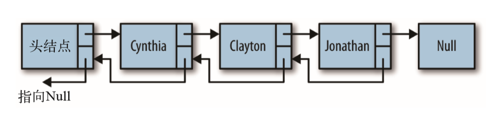
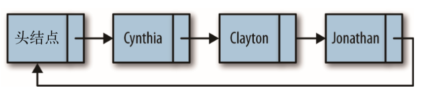

# 链表
## 设计一个基于对象的链表
- Node类表示节点
- LinkedList类提供插入节点、删除节点、显示列表元素等方法

### Node类
```
function Node(element){
    this.element = element;
    this.next = null;
}
```
### LinkedList类
```
function LList(){
    this.head = new Node("head");
    this.find = find;
    this.insert = insert;
    this.remove = remove;
    this.display = display;
}

//返回保存该数据的节点
function find(item){
    var currNode = this.head;
    while(currNode.element != item){
        currNode = currNode.next;
    }
    return currNode;
}

//插入元素
function insert(newElement,item){
    var newNode = new Node(newElement);
    var current = this.find(item);
    newNode.next = current.next;
    current.next = newNode;
}

//遍历链表
function display(){
    var currNode = this.head;
    while(!(currNode.next == null)){
        print(currNode.next.element);
        currNode = currNode.next;
    }
}
```

### 从链表中删除一个节点
```
function findPrevious(item){
    var currNode = this.head;
    while(!(currNode.next == null)&&(currNode.next.element!=item)){
        currNode = currNode.next;
    }
    return currNode;
}

function remove(item){
    var prevNode = this.findPrevious(item);
    if(!(prevNode.next == null)){
        prevNode.next = prevNode.next.next;
    }
}
```

## 双向链表
  
```
function Node(element){
    this.element = element;
    this.next = null;
    this.previous = null;
}

function insert(newElement,item){
    var newNode = new Node(newElement);
    var current = this.find(item);
    newNode.next = current.next;
    newNode.previous = current;
    current.next = newNode;
}

function remove(item){
    var currNode = this.find(item);
    if(!(currNode.next==null)){
        currNode.previous.next = currNode.next;
        currNode.next.previous = currNode.previous;
        currNode.next = null;
        currNode.previous = null;
    }
}

//findLast() 方法找出了链表中的最后一个节点
function findLast(){
    var currNode = this.head;
    while(!(currNode.next == null)){
        currNode = currNode.next;
    }
    return currNode;
}

//反序显示双向链表中的元素
function dispReverse(){
    var currNode = this.head;
    currNode = this.findLast();
    while(!(currNode.previous == null)){
        print(currNode.element);
        currNode = currNode.previous;
    }
}
```

## 循环链表
  

```
function LList(){
    this.head = new Node("head");
    this.head.next = this.head;
    this.find = find;
    this.insert = insert;
    this.display = display;
    this.findPrevious = findPrevious;
    this.remove = remove;
}

function display(){
    var currNode = this.head;
    while(!(currNode.next == null)&&!(currNode.next.element == "head")){
        print(currNode.next.element);
        currNode = currNode.next;
    }
}
```