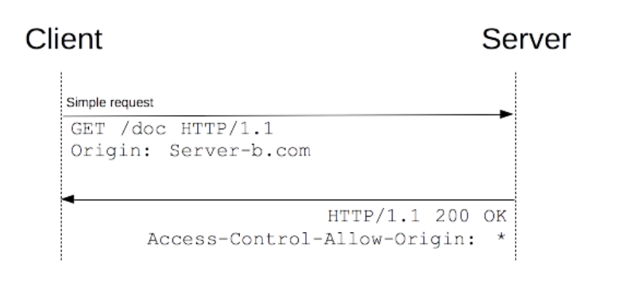
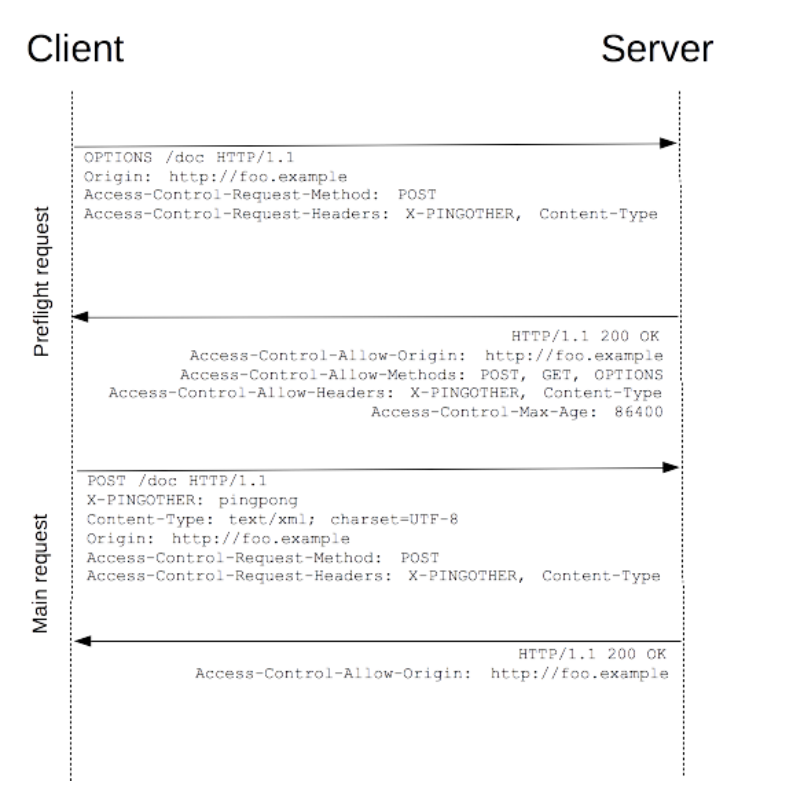
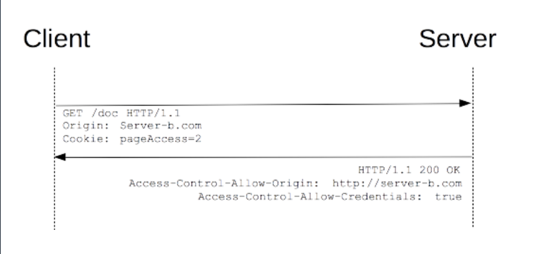

# 跨域资源共享(CORS)
> 跨域资源共享(CORS) 是一种机制，它使用额外的 HTTP 头来告诉浏览器  让运行在一个 origin (domain) 上的Web应用被准许访问来自不同源服务器上的指定的资源。当一个资源从与该资源本身所在的服务器不同的域、协议或端口请求一个资源时，资源会发起一个跨域 HTTP 请求。
比如，站点 http://domain-a.com 的某 HTML 页面通过 \ 的 src 请求 http://domain-b.com/image.jpg。网络上的许多页面都会加载来自不同域的CSS样式表，图像和脚本等资源。  

XMLHttpRequest和Fetch遵循同源策略,除非**响应报文包含正确CORS响应头**

## 功能概述
**跨域资源共享标准新增了一组HTTP首部字段,允许服务器声明哪些源站通过浏览器有权限访问哪些资源**

## 简单请求
假如站点 http://foo.example 的网页应用想要访问 http://bar.other 的资源。  

```
var invocation = new XMLHttpRequest();
var url = 'http://bar.other/resources/public-data/';

function callOtherDomain(){
    if(invocation){
        invocation.open('GET',url,true);
        invocation.onreadystatechange = handler;
        invocation.send();
    }
}
```
**客户端和服务端之间使用CORS首部字段来处理跨域权限**  

  

分别检视请求报文和响应报文：

```
GET /resources/public-data/ HTTP/1.1
Host: bar.other
User-Agent: Mozilla/5.0 (Macintosh; U; Intel Mac OS X 10.5; en-US; rv:1.9.1b3pre) Gecko/20081130 Minefield/3.1b3pre
Accept: text/html,application/xhtml+xml,application/xml;q=0.9,*/*;q=0.8
Accept-Language: en-us,en;q=0.5
Accept-Encoding: gzip,deflate
Accept-Charset: ISO-8859-1,utf-8;q=0.7,*;q=0.7
Connection: keep-alive
Referer: http://foo.example/examples/access-control/simpleXSInvocation.html
Origin: http://foo.example


HTTP/1.1 200 OK
Date: Mon, 01 Dec 2008 00:23:53 GMT
Server: Apache/2.0.61 
Access-Control-Allow-Origin: *
Keep-Alive: timeout=2, max=100
Connection: Keep-Alive
Transfer-Encoding: chunked
Content-Type: application/xml

[XML Data]
```
第1~10行是请求首部  
第10行 的请求首部字段 Origin 表明该请求来源于 http://foo.exmaple。  


第13~22行是来自于http://bar.other 的服务端响应  

> 服务端返回的 Access-Control-Allow-Origin: * 表明，该资源可以被任意外域访问。如果服务端仅允许来自 http://foo.example 的访问，该首部字段的内容如下：  
```
Access-Control-Allow-Origin:http://foo.example
```

## 预检请求
> “需预检的请求”要求必须首先使用 **OPTIONS** 方法发起一个预检请求到服务器，以获知服务器是否允许该实际请求。"预检请求“的使用，可以避免跨域请求对服务器的用户数据产生未预期的影响。  

如下是一个需要执行预检请求的 HTTP 请求：

```
var invocation = new XMLHttpRequest();
var url = 'http://bar.other/resources/post-here/';
var body = '<?xml version="1.0"?><person><name>Arun</name></person>';
    
function callOtherDomain(){
  if(invocation)
    {
      invocation.open('POST', url, true);
      invocation.setRequestHeader('X-PINGOTHER', 'pingpong');
      invocation.setRequestHeader('Content-Type', 'application/xml');
      invocation.onreadystatechange = handler;
      invocation.send(body); 
    }
}

//......
```
> XMLHttpRequest.setRequestHeader() 是设置HTTP请求头部的方法。此方法必须在  open() 方法和 send()   之间调用。如果多次对同一个请求头赋值，只会生成一个合并了多个值的请求头。  

使用 POST 请求发送一个 XML 文档，该请求包含了一个自定义的请求首部字段（X-PINGOTHER: pingpong）。另外，该请求的 Content-Type 为 application/xml。因此，该请求需要首先发起“预检请求”。  

  

```
OPTIONS /resources/post-here/ HTTP/1.1
Host: bar.other
User-Agent: Mozilla/5.0 (Macintosh; U; Intel Mac OS X 10.5; en-US; rv:1.9.1b3pre) Gecko/20081130 Minefield/3.1b3pre
Accept: text/html,application/xhtml+xml,application/xml;q=0.9,*/*;q=0.8
Accept-Language: en-us,en;q=0.5
Accept-Encoding: gzip,deflate
Accept-Charset: ISO-8859-1,utf-8;q=0.7,*;q=0.7
Connection: keep-alive
Origin: http://foo.example
Access-Control-Request-Method: POST
Access-Control-Request-Headers: X-PINGOTHER, Content-Type


HTTP/1.1 200 OK
Date: Mon, 01 Dec 2008 01:15:39 GMT
Server: Apache/2.0.61 (Unix)
Access-Control-Allow-Origin: http://foo.example
Access-Control-Allow-Methods: POST, GET, OPTIONS
Access-Control-Allow-Headers: X-PINGOTHER, Content-Type
Access-Control-Max-Age: 86400
Vary: Accept-Encoding, Origin
Content-Encoding: gzip
Content-Length: 0
Keep-Alive: timeout=2, max=100
Connection: Keep-Alive
Content-Type: text/plain
```
预检请求完成之后，发送实际请求：

```
POST /resources/post-here/ HTTP/1.1
Host: bar.other
User-Agent: Mozilla/5.0 (Macintosh; U; Intel Mac OS X 10.5; en-US; rv:1.9.1b3pre) Gecko/20081130 Minefield/3.1b3pre
Accept: text/html,application/xhtml+xml,application/xml;q=0.9,*/*;q=0.8
Accept-Language: en-us,en;q=0.5
Accept-Encoding: gzip,deflate
Accept-Charset: ISO-8859-1,utf-8;q=0.7,*;q=0.7
Connection: keep-alive
X-PINGOTHER: pingpong
Content-Type: text/xml; charset=UTF-8
Referer: http://foo.example/examples/preflightInvocation.html
Content-Length: 55
Origin: http://foo.example
Pragma: no-cache
Cache-Control: no-cache

<?xml version="1.0"?><person><name>Arun</name></person>


HTTP/1.1 200 OK
Date: Mon, 01 Dec 2008 01:15:40 GMT
Server: Apache/2.0.61 (Unix)
Access-Control-Allow-Origin: http://foo.example
Vary: Accept-Encoding, Origin
Content-Encoding: gzip
Content-Length: 235
Keep-Alive: timeout=2, max=99
Connection: Keep-Alive
Content-Type: text/plain

[Some GZIP'd payload]
```
第 1~12 行发送了一个使用 OPTIONS 方法的“预检请求”。用以从服务器获取更多信息。该方法不会对服务器资源产生影响。 预检请求中同时携带了下面两个首部字段：

```
Access-Control-Request-Method: POST
Access-Control-Request-Headers: X-PINGOTHER, Content-Type
```
> 首部字段 Access-Control-Request-Method 告知服务器，实际请求将使用 POST 方法。

> 首部字段 Access-Control-Request-Headers 告知服务器，实际请求将携带两个自定义请求首部字段：X-PINGOTHER 与 Content-Type。服务器据此决定，该实际请求是否被允许。  

首部字段 Access-Control-Request-Headers 告知服务器，实际请求将携带两个自定义请求首部字段：X-PINGOTHER 与 Content-Type。服务器据此决定，该实际请求是否被允许。

```
Access-Control-Allow-Origin: http://foo.example
Access-Control-Allow-Methods: POST, GET, OPTIONS
Access-Control-Allow-Headers: X-PINGOTHER, Content-Type
Access-Control-Max-Age: 86400
```
> 首部字段 Access-Control-Max-Age 表明该响应的有效时间为 86400 秒，也就是 24 小时。在有效时间内，浏览器无须为同一请求再次发起预检请求。请注意，浏览器自身维护了一个最大有效时间，如果该首部字段的值超过了最大有效时间，将不会生效。

## 附带身份凭证的请求
> Fetch 与 CORS 的一个有趣的特性是，可以基于  HTTP cookies 和 HTTP 认证信息发送身份凭证。一般而言，对于跨域 XMLHttpRequest 或 Fetch 请求，浏览器不会发送身份凭证信息。如果要发送凭证信息，需要设置 XMLHttpRequest 的某个特殊标志位。  

本例中，http://foo.example 的某脚本向 http://bar.other 发起一个GET 请求，并设置 Cookies：

```
var invocation = new XMLHttpRequest();
var url = 'http://bar.other/resources/credentialed-content/';
    
function callOtherDomain(){
  if(invocation) {
    invocation.open('GET', url, true);
    invocation.withCredentials = true;
    invocation.onreadystatechange = handler;
    invocation.send(); 
  }
}
```
第 7 行将 XMLHttpRequest 的 withCredentials 标志设置为 true，从而向服务器发送 Cookies。因为这是一个简单 GET 请求，所以浏览器不会对其发起“预检请求”。但是，如果服务器端的响应中未携带 Access-Control-Allow-Credentials: true ，浏览器将不会把响应内容返回给请求的发送者。  

  

```
GET /resources/access-control-with-credentials/ HTTP/1.1
Host: bar.other
User-Agent: Mozilla/5.0 (Macintosh; U; Intel Mac OS X 10.5; en-US; rv:1.9.1b3pre) Gecko/20081130 Minefield/3.1b3pre
Accept: text/html,application/xhtml+xml,application/xml;q=0.9,*/*;q=0.8
Accept-Language: en-us,en;q=0.5
Accept-Encoding: gzip,deflate
Accept-Charset: ISO-8859-1,utf-8;q=0.7,*;q=0.7
Connection: keep-alive
Referer: http://foo.example/examples/credential.html
Origin: http://foo.example
Cookie: pageAccess=2


HTTP/1.1 200 OK
Date: Mon, 01 Dec 2008 01:34:52 GMT
Server: Apache/2.0.61 (Unix) PHP/4.4.7 mod_ssl/2.0.61 OpenSSL/0.9.7e mod_fastcgi/2.4.2 DAV/2 SVN/1.4.2
X-Powered-By: PHP/5.2.6
Access-Control-Allow-Origin: http://foo.example
Access-Control-Allow-Credentials: true
Cache-Control: no-cache
Pragma: no-cache
Set-Cookie: pageAccess=3; expires=Wed, 31-Dec-2008 01:34:53 GMT
Vary: Accept-Encoding, Origin
Content-Encoding: gzip
Content-Length: 106
Keep-Alive: timeout=2, max=100
Connection: Keep-Alive
Content-Type: text/plain


[text/plain payload]
```
即使第 11 行指定了 Cookie 的相关信息，但是，如果 bar.other 的响应中缺失 Access-Control-Allow-Credentials: true（第 19 行），则响应内容不会返回给请求的发起者。  

### 附带身份凭证的请求与通配符
对于附带身份凭证的请求，服务器不得设置 Access-Control-Allow-Origin 的值为“*”。

这是因为请求的首部中携带了 Cookie 信息，如果 Access-Control-Allow-Origin 的值为“*”，请求将会失败。而将 Access-Control-Allow-Origin 的值设置为 http://foo.example，则请求将成功执行。

另外，响应首部中也携带了 Set-Cookie 字段，尝试对 Cookie 进行修改。如果操作失败，将会抛出异常。