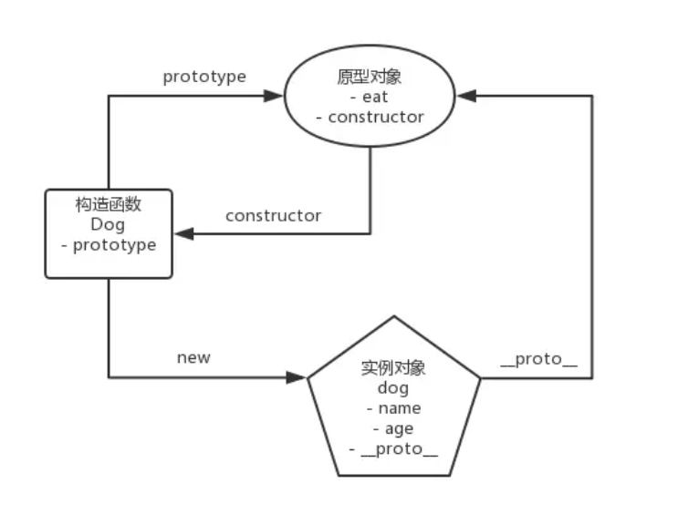
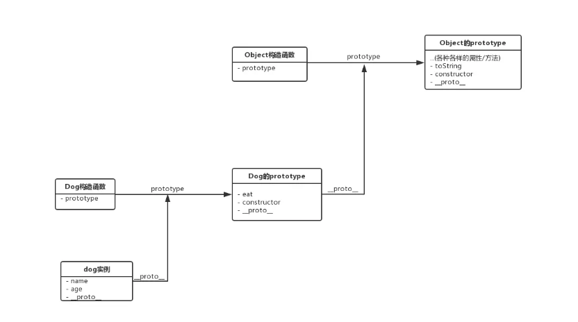

# 原型模式
在原型模式下，当我们想要创建一个对象时，会先找到一个对象作为原型，然后通过克隆原型的方式来创建出一个与原型一样（共享一套数据/方法）的对象。  

- Object.create  

> ECMAScript 2015 中引入的 JavaScript 类实质上是 JavaScript 现有的基于原型的继承的语法糖。类语法不会为 JavaScript 引入新的面向对象的继承模型

```
class Dog{
    constructor(name,age){
        this.name = name;
        this.age = age;
    }

    eat(){
        console.log('肉骨头真好吃');
    }
}
```
等价于

```
function Dog(name,age){
    this.name = name;
    this.age = age;
}

Dog.prototype.eat = function(){
    console.log('肉骨头真好吃');
}
```

原型编程范式的核心思想就是**利用实例来描述对象，用实例作为定义对象和继承的基础**。在 JavaScript 中，原型编程范式的体现就是**基于原型链的继承**。

## 原型
```
// 创建一个Dog构造函数
function Dog(name, age) {
  this.name = name
  this.age = age
}

Dog.prototype.eat = function() {
  console.log('肉骨头真好吃')
}

// 使用Dog构造函数创建dog实例
const dog = new Dog('旺财', 3)
```


## 原型链
```
dog.eat();
dog.toString();
```
试图访问一个 JavaScript 实例的属性/方法时，它首先搜索这个实例本身；当发现实例没有定义对应的属性/方法时，它会转而去搜索实例的原型对象；如果原型对象中也搜索不到，它就去搜索原型对象的原型对象，这个**搜索的轨迹，就叫做原型链**。  



## 对象的深拷贝
1. JSON.stringify

```
const liLei = {
    name: 'lilei',
    age: 28,
    habits: ['coding', 'hiking', 'running']
}

const liLeiStr = JSON.stringify(liLei)
const liLeiCopy = JSON.parse(liLeiStr)

liLeiCopy.habits.splice(0, 1) 
console.log('李雷副本的habits数组是', liLeiCopy.habits)
console.log('李雷的habits数组是',  liLei.habits)
```

2. 递归实现

```
function deepClone(obj){
    //如果是值类型或null,则直接return
    if(typeof obj !== 'object' || obj === null){
        return obj;
    }

    //定义结果对象
    let copy = {};

    //如果对象是数组，则定义结果数组
    if(obj.constructor === Array){
        copy = [];
    }

    //遍历对象的key
    for(let key in obj){
        //如果key是对象的自有属性
        if(obj.hasOwnProperty(key)){
            //递归调用深拷贝
            copy[key] = deepClone(obj[key]);
        }
    }

    return copy;
}
```
> hasOwnProperty（）方法返回一个布尔值，该布尔值指示对象是否具有指定的属性作为其自身的属性（而不是继承它）。
