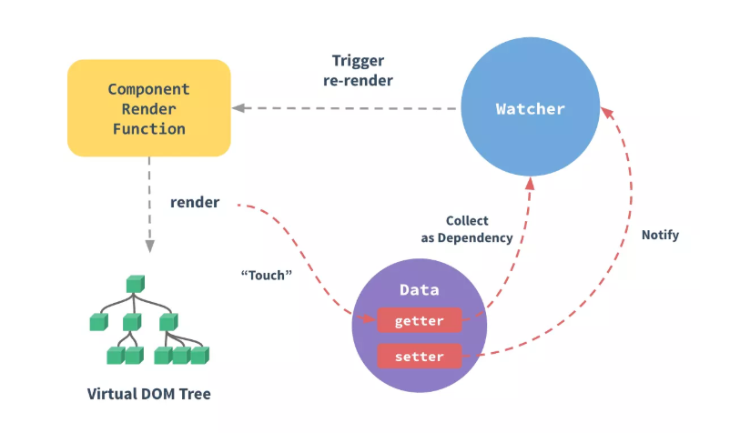
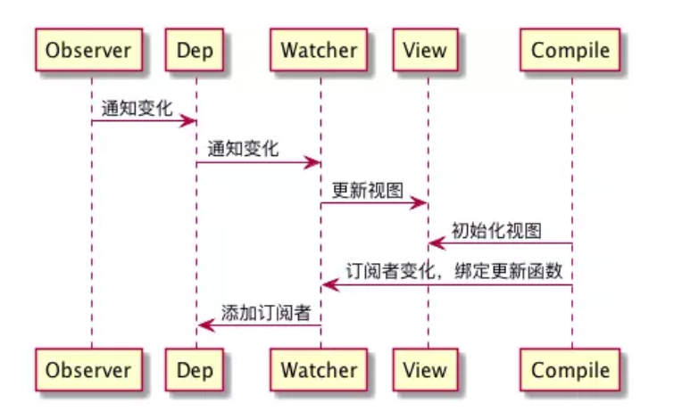
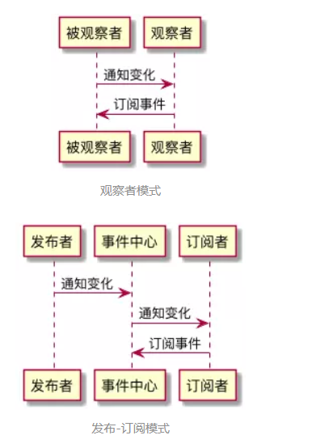

# 观察者模式
## Vue数据绑定(响应式系统)的实现原理
  

在 Vue 中，每个组件实例都有相应的 **watcher 实例对象**，它会在组件渲染的过程中**把属性记录为依赖**，之后当依赖项的**setter被调用**时，会通知**watcher 重新计算**，从而致使它关联的组件得以更新——这是一个典型的观察者模式。  

- **observer(监听器)**：vue是一个数据监听器，还需要对监听到的数据进行**转发**，它同时还是一个发布者
- **watcher(订阅者)**：observer把数据发给watcher,watcher接收到新的数据后，会去更新视图
- **compile(编译器)**：负责对每个结点元素指令进行扫描和解析，指令的数据初始化、订阅者的创建这些“杂活”也归它管  



### 核心代码
#### 实现observer
```
//observer方法遍历并包装对象属性
function observe(target){
    //若target是一个对象，则遍历它
    if(target && typeof target === 'object'){
        //Object.keys() 方法会返回一个由一个给定对象的自身可枚举属性组成的数组
        Object.keys(target).forEach((key)=>{
            //defineReactive方法会给目标属性装上“监听器”
            defineReactive(target,key,target[key]);
        })
    }
}

//定义defineReactive方法
function defineReactive(target,key,val){
    //属性值也可能是object类型，这种情况下需要调用observe进行递归遍历
    observe(val);
    //为当前属性安装监听器
    Object.defineProperty(target,key,{
        //可枚举
        enumerable:true,
        //不可配置
        configurable:false,
        get:function(){
            return val;
        },
        //监听器函数
        set:function(value){
            console.log(`${target}属性的${key}属性从${val}值变成了${value}`);
            val = value;
        }
    });
}
```
#### 实现订阅者Dep
```
//定义订阅者类Dep
class Dep{
    constructor(){
        //初始化订阅队列
        this.subs = [];
    }

    //增加订阅者
    addSub(sub){
        this.subs.push(sub);
    }

    //通知订阅者
    notify(){
        this.subs.forEach((sub)=>{
            sub.update();
        })
    }
}
```
改写 defineReactive 中的 setter 方法，在监听器里去通知订阅者
```
function defineReactive(target,key,val){
    const dep = new Dep();
    //监听当前属性
    observe(val);
    Object.defineProperty(target,key,{
        set:(value)=>{
            //通知所有订阅者
            dep.notify();
        }
    })
}
```

## 实现一个Event Bus/Event Emitter
### 在Vue中使用Event Bus来实现组件间的通讯
Event Bus/Event Emitter 作为全局事件总线，它起到的是一个**沟通桥梁**的作用。我们可以把它理解为一个事件中心，我们所有事件的订阅/发布都不能由订阅方和发布方“私下沟通”，必须要委托这个事件中心帮我们实现。  

```
//创建一个Event Bus
const EventBus = new Vue();
export default EventBus;
```

```
//在主文件里引入EventBus，并挂载到全局：
import bus from 'EventBus的文件路径';
Vue.prototype.bus = bus;
```

```
//订阅事件
//这里func指someEvent这个事件的监听函数
this.bus.$on('someEvent',func);
```

```
//发布(触发)事件
// 这里params指someEvent这个事件被触发时回调函数接收的入参

this.bus.$emit('someEvent',params);
```

### 实现一个Event Bus

```
class EventEmitter{
    constructor(){
        //handlers是一个map，用于存储事件与回调之间的对应关系
        this.handlers = {};
    }

    //on方法用于安装事件监听器，它接受目标事件名和回调函数作为参数
    on(eventName,cb){
        //先检查一下目标事件名有没有对应的监听函数队列
        if(!this.handlers[eventName]){
            //如果没有，那么首先初始化一个监听函数队列
            this.handlers[eventName] = [];
        }

        //把回调函数推入目标事件的监听函数队列里
        this.handlers[eventName].push(cb);
    }

    //emit方法用于触发目标事件，它接受事件名和监听函数入参作为参数
    emit(eventName,...args){
        //检查目标事件是否有监听函数队列
        if(this.handlers[eventName]){
            //如果有，则逐个调用队列里的回调函数
            this.handlers[eventName].forEach((callback)=>{
                callback(...args);
            })
        }
    }

    //移除某个事件回调队列里的指定回调函数
    off(eventName,cb){
        const callbacks = this.handlers[eventName];
        const index = callbacks.indexOf(cb);
        if(index !== -1){
            callbacks.splice(index,1);
        }
    }

    //为事件注册单次监听器
    once(eventName,cb){
        //对回调函数进行包装，使其执行完毕自动被移除
        const wrapper = (...args) => {
            cb.apply(...args);
            this.off(eventName,wrapper);
        }
        this.on(eventName,wrapper);
    }
}
```

## 观察者模式与发布-订阅模式的区别
韩梅梅把所有的开发者拉了一个群，直接把需求文档丢给每一位群成员，这种**发布者直接触及到订阅者**的操作，叫**观察者模式**。但如果韩梅梅没有拉群，而是把需求文档上传到了公司统一的需求平台上，需求平台感知到文件的变化、自动通知了每一位订阅了该文件的开发者，这种**发布者不直接触及到订阅者、而是由统一的第三方来完成实际的通信的操作，叫做发布-订阅模式**。  

  

观察者模式，解决的其实是模块间的耦合问题，有它在，即便是两个分离的、毫不相关的模块，也可以实现数据通信。但观察者模式仅仅是减少了耦合，并没有完全地解决耦合问题——被观察者必须去维护一套观察者的集合，这些观察者必须实现统一的方法供被观察者调用。  

发布-订阅模式，发布者完全不用感知订阅者，不用关心它怎么实现回调方法，事件的注册和触发都发生在独立于双方的第三方平台（事件总线）上。发布-订阅模式下，实现了完全地解耦。