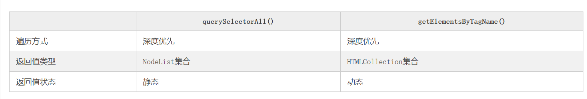

  

getElement方法性能好,query选择符更方便(舍弃性能)  

getElementsByTagName() 速度比 querySelectorAll() 快的根本原因在于动态NodeList和静态NodeList对象的不同。 尽管我可以肯定地说有某种方法来优化这一点, 在获取NodeList时不需要执行很多前期处理操作的动态列表,总比获取静态的集合(返回之前完成各种处理)要快很多。 哪个方法更好用主要还是看你的需求, 如果只是要根据 tag name 来查找元素, 也不需要获取此一个快照, 那就应该使用 getElementsByTagName()方法; 如果需要快照结果(静态),或者需要使用复杂的CSS查询, 则可以考虑querySelectorAll()。